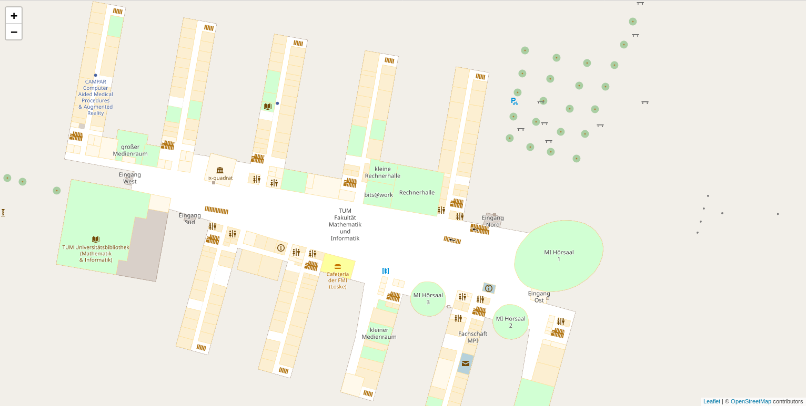

# Indoor Semantics Annotation
This project is provided indoor stylesheet for informatics building at TUM. There are three versions of indoor stlesheet. However, the seleected version is version three, which is the most updated version. 
Informatics bulding is edited for levelo and contained in osm file data "munich_test.osm" Anoter osm file contains Glasgow airport at level 1.

## Installation
This project is used [OpenStreetMap-Carto Stylesheet](https://github.com/gravitystorm/openstreetmap-carto) following [building tile server totorial](https://switch2osm.org/serving-tiles/manually-building-a-tile-server-18-04-lts/).

## Usage

All of file in version folder need to be placed in 
```bash
openstreetmap-carto
```
Before adding indoor.mss file to openstreetmap-carto folder, the following files need to be edited first. 
```bash
- project.mml
- openstreetmap-carto.lua
- openstreetmap-carto.style

```
#### project.mml
Layer indoors need to be updated in project.mml file.
-Stylesheet section:
```bash
Stylesheet:
  - indoors.mss

```
-Layer section:
```bash
Layer:
  - id: indoors...
  - id: indoors-text...
```
#### openstreetmap-carto.lua
Openstreetmap-carto.lua need to be added 'indoor' and 'room' to polygon_key section
```bash
local polygon_keys = {
    'indoor',
    'room'
}
```
#### openstreetmap-carto.style
OSM type of indoor and room need to be added in openstreetmap-carto.style
```bash
# OsmType  Tag          DataType     Flags
node,way   indoor       text         polygon
node,way   room         text         polygon
```

After finishing configuration, XML file need to be generated by using command below.
```bash
carto project.mml > mapnik.xml
```
Moreover, osm file should be upload before rendering the maptiles. The preview picture reveals the final version of v3 folder by using Leaflet preview HTML page. 



